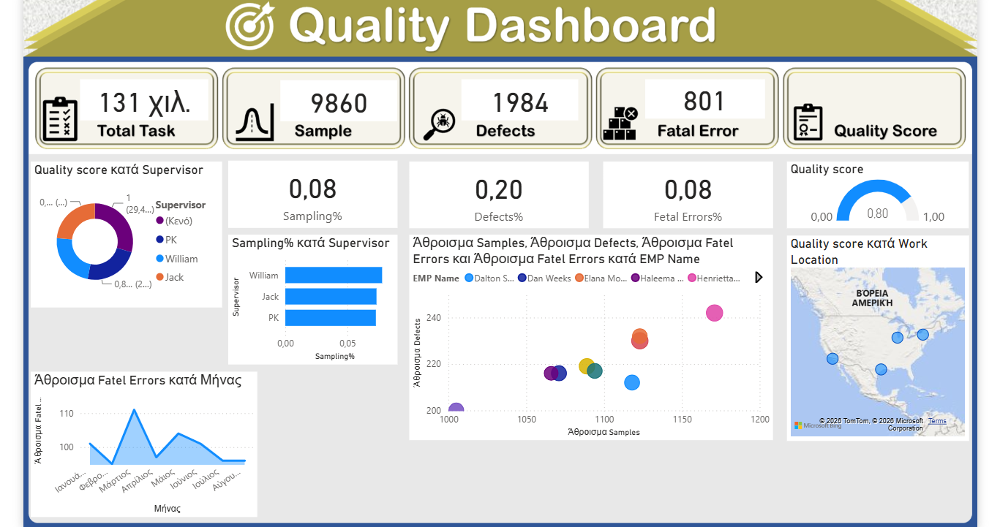

# Power BI – Quality & Employee Performance Analysis

Power BI project focused on analyzing quality metrics and employee performance.

## Dashboard Overview

The dashboard provides an overview of quality and employee performance using key metrics and interactive visualizations.

## Key Analysis

- Total Tasks
- Samples and Sampling %
- Defects and Defects %
- Fatal Errors and Fatal Errors %
- Quality Score
- Performance by Employee
- Performance by Supervisor
- Performance by Work Location

## Tools & Skills

- Power BI
- Data Modeling
- Data Visualization
- Dashboard Design
- KPI Analysis
- Interactive Reports
- Tooltips

## Project File

The complete Power BI report is available in this folder as a `.pbix` file.
