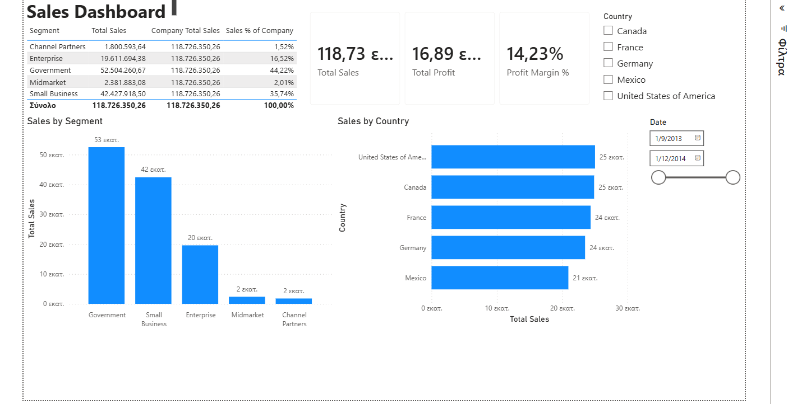

# Power BI – Sales & Financial Analysis

Power BI project focused on analyzing sales and financial performance across countries and business segments.

## Dashboard Preview

A dashboard was created to provide an overview of sales performance, profitability, and sales distribution across different countries and customer segments.

## Key Analysis

- Total Sales
- Total Profit
- Profit Margin %
- Sales by Country
- Sales by Segment
- Country and Date filtering
- Year-to-Date (YTD) Sales
- Previous Year Sales
- Sales Growth %

## Tools & Skills

- Power BI
- Power Query
- Data Modeling
- DAX
- Time Intelligence
- Data Visualization
- Interactive Reports & Dashboards

## Project Files

The repository includes the Power BI (.pbix) file and a dashboard preview.
